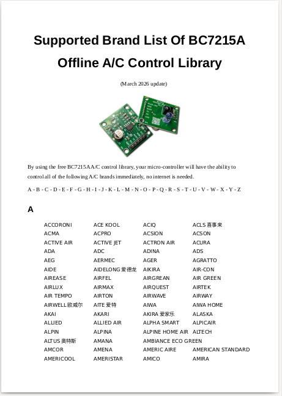
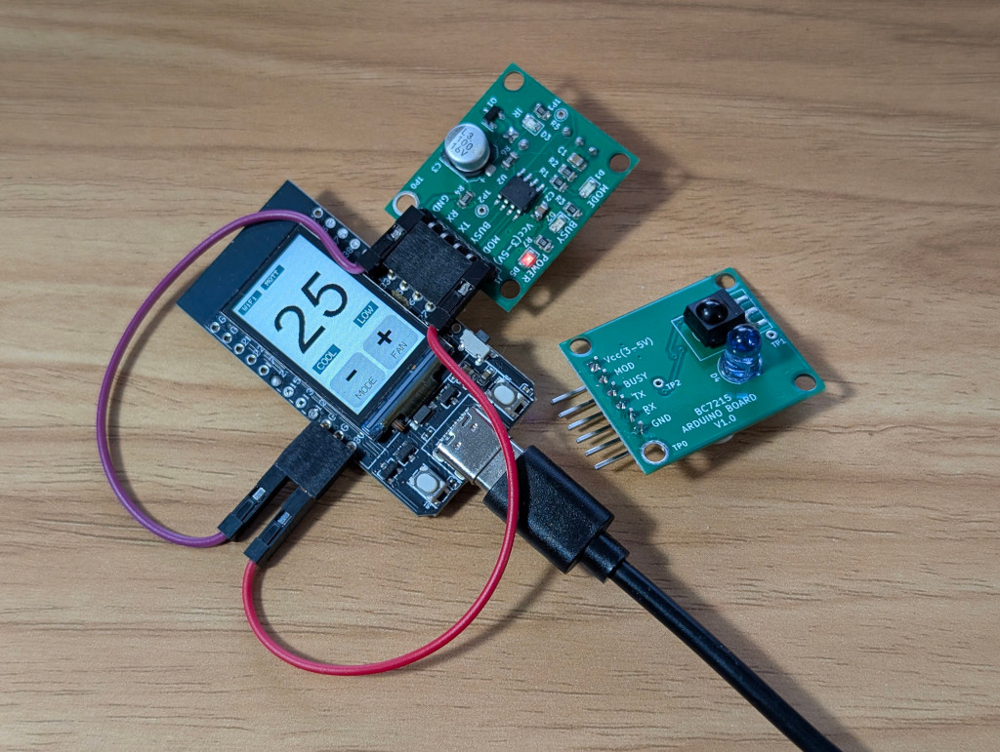

# BC7215AC Offline Universal Air Conditioner IR Control Library For Arduino

[[简体中文](./extras/doc/README_CN.md)]

There's also a C version of this library for generic micro-controllers: [https://github.com/bitcode-tech/bc7215_ac_lib](https://github.com/bitcode-tech/bc7215_ac_lib)

****2 major functionalities of this library:****

* ##### Sending IR to control Temp, Mode, Fan & Power of an A/C

* ##### Receiving IR to decode these information from the signal

This library uses BC7215A chip as it's core functioning component and can let your Arduino control almost any air conditioner available on the market

 

[Supported brands list](./extras/doc/Supported_ac_brand_list-en.pdf)

It runs locally with a small footprint, no online database is needed! The library leverages the BC7215A's ability to decode/transmit IR signal in arbitrary format, and can recognise and pair with any air conditioner with one click. 

**Relative Documents:**

[BC7215A datasheets](./extras/doc/bc7215_en.pdf)

[Schematic of the BC7215A IR transceiver board](./extras/doc/bc7215_arduino_board.pdf) 

This is the Arduino encapsulation of the same library's C version, making it work seamlessly with Arduino through simple function calls. The library supports key air conditioner operations: temperature adjustment, mode selection, fan speed control, and power on/off. It also supports parsing of the IR signal, read these settings form IR.

2 manuals are provided:

* [A/C Control Library User's Manual](./extras/doc/BC7215AC_arduino_ac_lib.pdf)

* [User's Manual for built-in examples](./extras/doc/AC_control_examples.md)

Though the library user's manual (pdf) available in the document directory provides more details, the best way to learn about this library is to follow the examples. There are 5 examples provided with the library, and each one has both English and Chinese versions:

- **ESP8266 Serial Monitor Version**
- ****ESP32 Serial Monitor Version****
- ****Arduino Nano 33 IoT Serial Monitor Version****
- ****ESP32 LCD Version****
- ****ESP32 MQTT online IoT Version****
- **ESP32 Home Assistant Example**
- **ESP8266 Home Assistant Example**

It's recommended to start with the serial monitor examples to get familiar with the library functions, then progress to LCD and MQTT versions for more advanced integrations.

"**ESP8266 Serial Monitor Version**" Using software serial for communication with the BC7215A and the Arduino IDE serial monitor for user interaction. It demonstrates all the features of this library. 

"**ESP32 Serial Monitor Version**" is port of the ESP8266 example, adapted for ESP32 hardware.

**"Arduino Nano 33 Iot Serial Monitor Version"** is a port to the popular official board with ATMEL SAMD processor.

"**ESP32 LCD Version**" utilize the LILYGO T-Display's onboard buttons and LCD for a user-friendly interface, demonstrating control without relying on a computer.

"**ESP32 MQTT IoT Version**" extend the LCD version with networking capabilities, allowing MQTT-based remote control and status reporting for IoT applications.

"**ESP32/8266 Home Assistant Example**" Can promote itself to Home Assistant and get Integrated automatically, then you can control the AC in HA immediately.

Please see [**A/C Control Examples**](./extras/doc/AC_control_examples.md) (markdown) for detailed information about the examples. Or the [**PDF version**](./extras/doc/AC_control_examples.pdf) if you prefer.

## Other Documents:

This A/C remote control library comes with the BC7215 chip driver library as a low level driver,  Here are the relative documents:

[**BC7215 CHIP DRIVER LIBRARY README FILE**](./extras/doc/README_BC7215_DRIVER.md)
