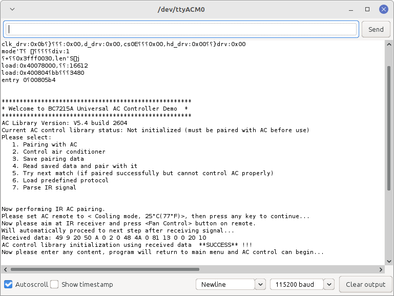
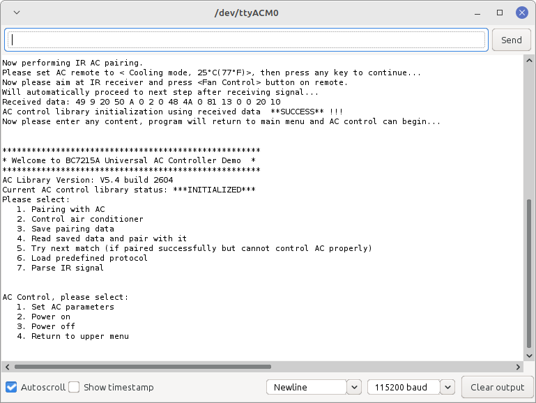
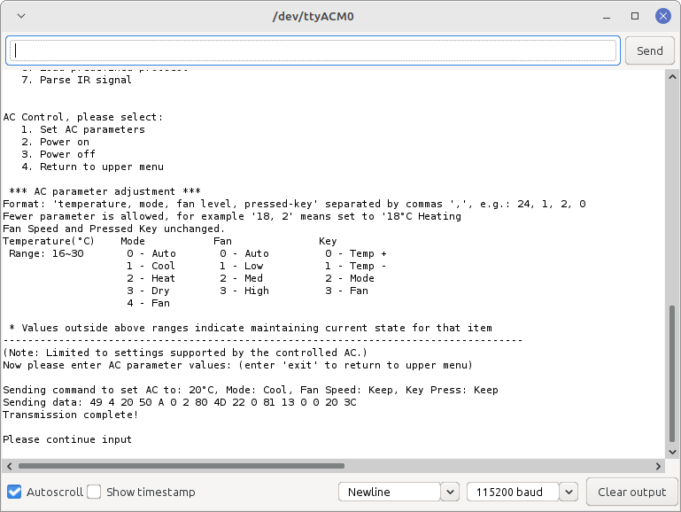
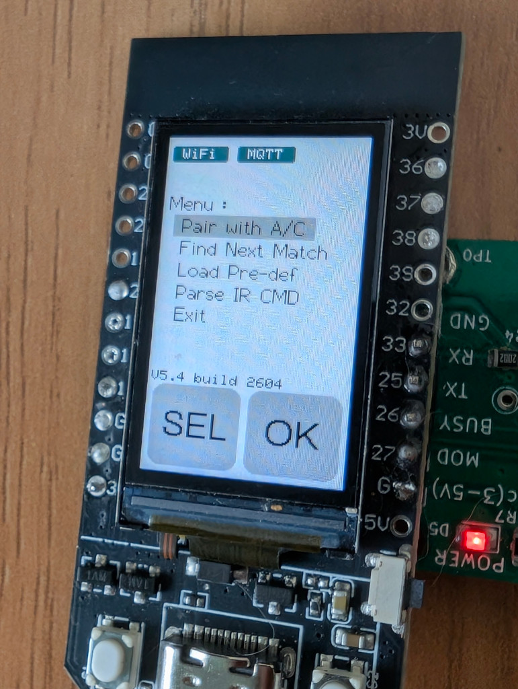
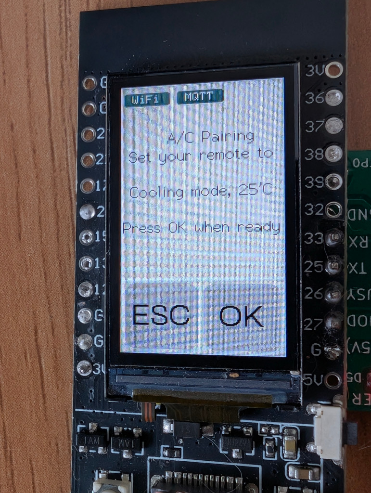
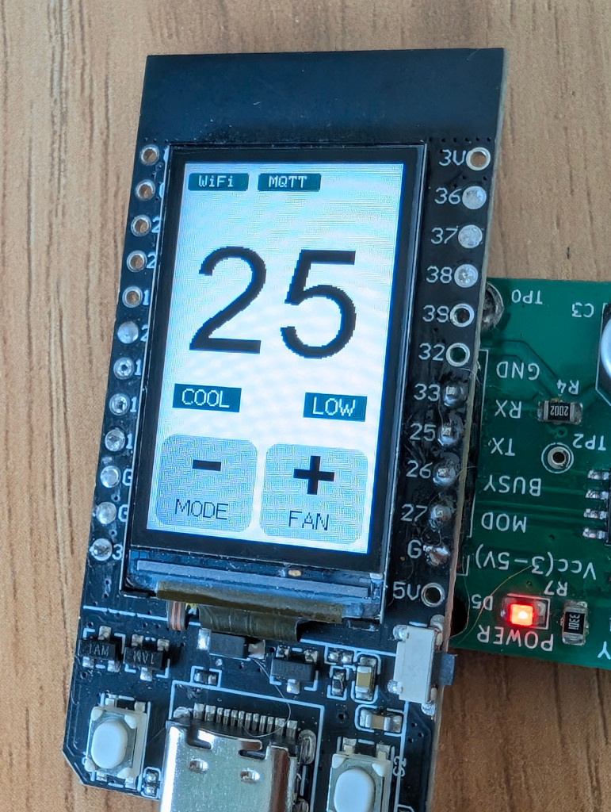
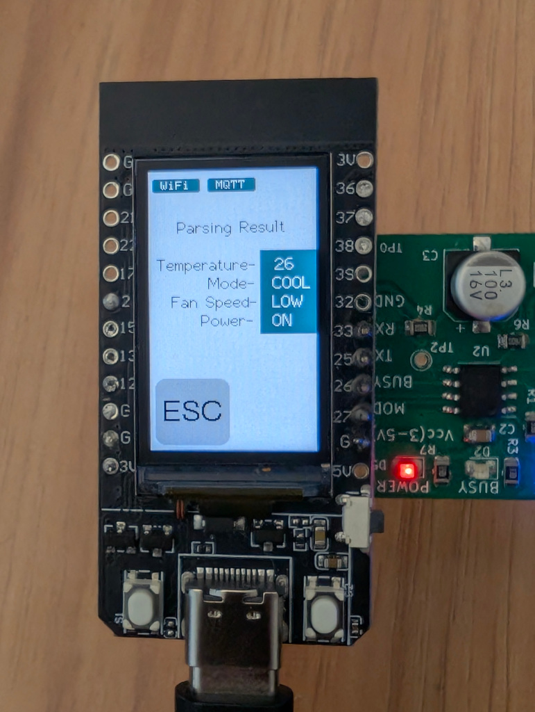

# BC7215AC  A/C Control Examples

---

The **BC7215AC Air Conditioner Remote Control Library** provides 5 example applications, each available in both English and Chinese versions:  

- 
- ESP8266 Serial Monitor
- ESP32 Serial Monitor  
- NANO 33 IoT Serial Monitor
- ESP32 LCD  
- ESP32 MQTT  
- ESP32 Home Assistant
- ESP8266 Home Assistant

The **Serial Monitor version** is the simplest demo. It only requires connecting any ESP8266 or ESP32 Arduino development board to the BC7215A IR transceiver module, then using the Arduino IDE’s built-in Serial Monitor as the human–machine interface to control the air conditioner.  

The **LCD** and **MQTT** versions require the LilyGO TTGO T-Display ESP32 board, which comes with a built-in LCD display and two physical buttons. These hardware features allow the demo programs to run independently without a PC.  

The **MQTT version** builds on the LCD version by adding MQTT networking support. This enables users to test network-based air conditioner control via a public MQTT broker. The MQTT version still retains local button control and can report the updated air conditioner state to the MQTT server.  

The examples use ESP8266 NodeMCU boards and ESP32 TTGO T-Display boards. The hardware connections are as follows:  

**ESP8266:**  

- GPIO5 → BC7215A TX  
- GPIO16 → BC7215A RX  
- GPIO14 → BC7215A MOD  
- GPIO4 → BC7215A BUSY  
- 3.3V → BC7215A VCC  


**ESP32:**  

- GPIO25 → BC7215A TX  
- GPIO33 → BC7215A RX  
- GPIO27 → BC7215A MOD  
- GPIO26 → BC7215A BUSY  
- 3.3V → BC7215A VCC  


### Arduino NANO33 IoT:

- RX - BC7215A TX

- TX - BC7215A RX

- D3 - BC7215A MOD

- D2 - BC7215A BUSY

- 3.3V - BC7215A VCC
  
  

---

## Serial Monitor Version

This version uses the Arduino IDE Serial Monitor (baud rate: 115200). Three program variants are provided:  

- NANO 33 Iot
- ESP8266
- ESP32  

The **serial monitor version** uses a state machine so tasks can proceed in parallel without getting stuck.  
After uploading the program, the main menu appears in the Serial Monitor. If not, simply press Enter or reset the Arduino board.  



### Initialization

First-time use requires **Pairing With A/C**. The collected data is used to initialize the library. The process is step-by-step, guided on-screen. If pairing fails repeatedly, the AC model may be one of the rare types that BC7215A cannot directly decode. In this case, you can try using **predefined protocols** to test control.  

### A/C Control

Once initialized successfully, you can start controlling the AC through a **two-level menu**:  

1. Choose control type (parameters such as temperature, or power on/off).  

2. Enter parameter values (temperature, mode, fan speed).  





---

## ESP32 LCD Version

This version uses the TTGO T-Display Arduino board (135×240 ST7789 LCD). It relies on **Bodmer’s TFT_eSPI library**, installable via Arduino IDE Library Manager.  
You must configure the library by replacing `User_Setup.h` in TFT_eSPI with the one provided in the `extras/config` directory of the BC7215AC library.  

When the program runs for the first time, the menu appears:  

- Left button (**SEL**) selects items.  
- Right button (**OK**) confirms.   



### Initialization

First, perform initialization by sampling the AC remote.  



If successful, the program enters the **AC control page**:  



**Button functions:**  

- Left short press: Decrease temperature  
- Right short press: Increase temperature  
- Left long press: Switch mode  
- Right long press: Switch fan speed  
- Double short press: Enter power control page (left = power on, right = power off)  
- Double long press: Enter main menu  

Whenever an action changes AC state, BC7215A transmits the corresponding IR signal, and an indicator appears at the top-right of the screen.  

---

## ESP32 MQTT Version

The MQTT version extends the LCD version with:  

1. **MQTT-based network control**  
2. **Air conditioner status reporting**  

It uses **Nick O’Leary’s PubSubClient library** (available in Arduino IDE Library Manager).  

### 1. Preparation Before Compilation

Before compiling, uncomment the following lines in the source and replace with your own values:  

```cpp
// WiFi and device configuration - replace with your values
#define MY_WIFI_SSID     "Your WiFi Name"
#define MY_WIFI_PASSWORD "Your WiFi Password"
#define MY_UUID          "Your UUID"
```

Use a UUID generator to create a unique device ID. If two devices share the same UUID, one will be disconnected by the MQTT server.  
Example UUID: `b1225e25-81c8-43d7-8183-6f5793408242`  

Default MQTT broker: `broker.hivemq.com`  
(You may also use public brokers such as `broker.emqx.io`).  

⚠️ **Note:** This demo uses an unencrypted connection. For production, use TLS-encrypted MQTT.  

---

### 2. Network-Controlled A/C

On startup, the device connects to WiFi, then to the MQTT server. Once connected, WiFi and MQTT icons appear on the screen.  


**MQTT Topics:**  

- Temperature: `BC7215A/<UUID>/var/temp`  
- Mode: `BC7215A/<UUID>/var/mode`  
- Fan speed: `BC7215A/<UUID>/var/fan`  
- Power: `BC7215A/<UUID>/var/power`  

Example:  
`BC7215A/b1225e25-81c8-43d7-8183-6f5793408242/var/temp`  

**Message formats:**  

- **Temperature:** `"16"` – `"30"`  
- **Mode:**  
  - 0 = Auto  
  - 1 = Cool  
  - 2 = Heat  
  - 3 = Dry  
  - 4 = Fan  
- **Fan:**  
  - 0 = Auto  
  - 1 = Low  
  - 2 = Medium  
  - 3 = High  
- **Power:**  
  - 0 = Off  
  - 1 = On  

---

### A/C Online Monitor

Once connected with MQTT server, any A/C status change will be published online, including both MQTT command and local operation, if program is in "parsing mode", it will also report the parsing result online. So you can monitor the A/C working status online even the user operates the A/C by a traditional IR remote.



## MQTT Client

Most free public brokers provide web or desktop MQTT clients. Any client can publish control messages as long as it connects to the same server and topics.  

Example HiveMQ web client:  
[https://www.hivemq.com/demos/websocket-client/](https://www.hivemq.com/demos/websocket-client/)  

To use it: open the page, leave all fields as is and click "Connect",


When it's connected, setup the topics and and it's ready to go.


"Publish" area is for the online A/C control, temperature and others each have their own topics, enter the value to be set and "publish" it, the BC7215A module will send IR to control the A/C.

"Subscriptions" is for the A/C status report, received reports will be shown in "Messages" area.

---

### AC Status Reporting

Whenever an IR command is sent (via button or MQTT), or in the parsing mode when an IR signal is received, the new AC state is reported to the MQTT server. Clients subscribed to the **report topic** will receive updates:  

`BC7215A/<UUID>/var/report`  

# ESP32 Home Assistant

Based on the ESP32 MQTT Edition, this version modifies the MQTT parameters to meet Home Assistant (HA) requirements. When used with Home Assistant and its MQTT integration, the device supports automatic discovery without any manual configuration. This enables a plug-and-play integration into the HA ecosystem for air conditioner control.
Once the device is powered on and successfully paired with the air conditioner, the AC controller entity will automatically appear within Home Assistant.


The firmware is configured to use a local network (LAN) MQTT server. For Home Assistant users, a local server is the optimal choice as it eliminates the need for complex account credentials and encryption settings while maintaining security within the local network. The Home Assistant Edition retains all operations of the standard ESP32 MQTT version, simply adjusting the MQTT server settings and topics to align with HA specifications.

# ESP8266 Home Assistant

Based on the ESP32 version, this edition removes the LCD display and the physical button array. It utilizes a single onboard button for re-pairing:
**Pairing Process:** Long-press the button for 2 seconds to enter pairing mode. The user then points an IR remote at the receiver and sends a "25°C, Cooling Mode" signal.
Since there is no display, a single onboard LED serves as the status indicator:

- Slow Flashing: Not connected to the BC7215A chip.

- Fast Flashing: Pairing mode; waiting to receive an IR signal.

- Short Flash every 3s: Successfully paired; in command parsing mode, waiting for IR signals.

Due to the lack of a user interface, several interactive operations—such as "Select Temperature Unit," "Next Match," and "Use Predefined Data"—have been omitted. However, this simplified version is sufficient for the vast majority of use cases. 

Since the device lacks local physical controls, it enters parsing mode immediately after pairing. If a user operates the air conditioner using a standard IR remote, the latest AC status will be synchronized to Home Assistant automatically.
