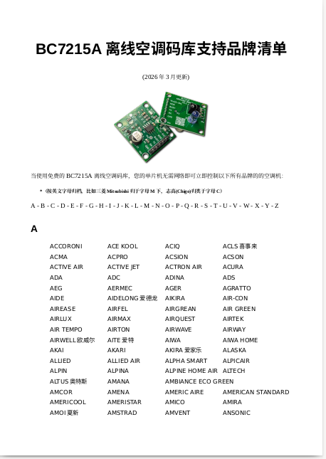
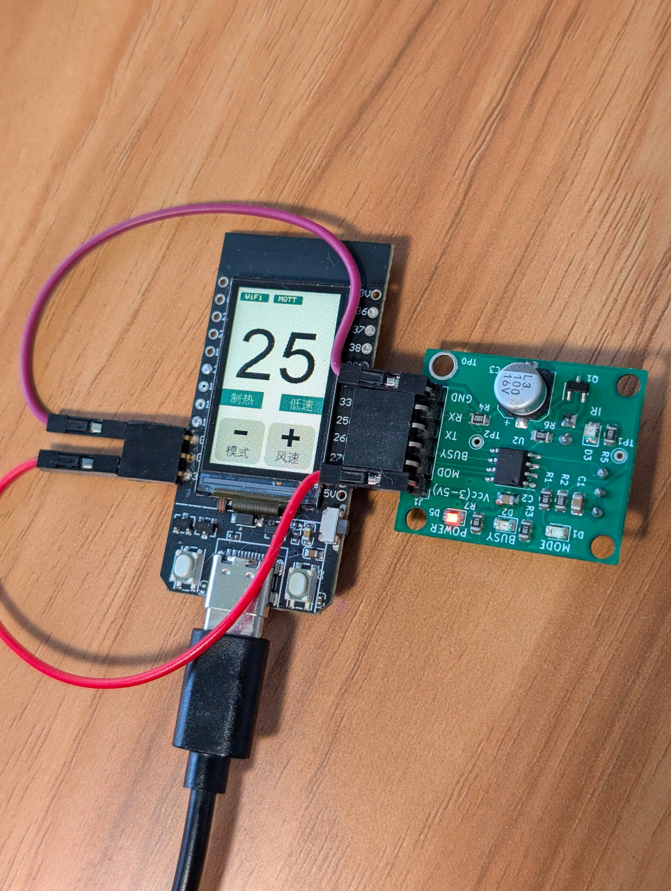

# BC7215AC 通用空调红外遥控库 For Arduino

[\[English\]](../../README.md)

本库另有适用于通用单片机的 C 语言版本: [https://github.com/bitcode-tech/bc7215_ac_lib](https://github.com/bitcode-tech/bc7215_ac_lib)

**本库的2大功能：**

* ##### 离线发送红外信号控制空调的温度、模式、风力及电源

* ##### 离线解码红外信号读取其中的以上设置参数

本库使用 BC7215A 芯片作为核心功能组件，可以让您的 Arduino 控制市场上几乎所有的空调。

[支持空调品牌清单](./BC7215A码库空调品牌清单.pdf)

并且所有操作都在本地运行，占用空间小，无需在线数据库！该库利用了 BC7215A 能够解码/发送任意格式红外信号的能力，可以一键识别并配对任何空调。

相关资料：

        [BC7215A芯片技术手册](./bc7215.pdf)

        [BC7215A红外收发板电路图](./bc7215_arduino_board.pdf)

本库为相同功能的 C 语言版本的Arduino封装，使其能够通过简单的函数调用与 Arduino 无缝协作。该库支持主要的空调操作功能：温度调节、模式选择、风速控制以及开关机。

提供了2种用户手册：

* [空调码库用户手册](./BC7215AC_arduino_空调遥控库.pdf)

* [随库例程用户手册](./空调遥控应用示例.md)

虽然文档目录中提供的用户手册(pdf)包含更多详细信息，但学习本库的最佳方式是通过实际使用例子。库中提供了 5 个示例，每个示例都有英文和中文版本：

- ESP8266 串口监视器版
- ESP32 串口监视器版
- NANO 33 IoT串口监视器版
- ESP32 LCD 版
- ESP32 MQTT 物联网版
- ESP32 Home Assistant例程
- ESP8266 Home Assistant例程

建议从串口监视器示例开始，熟悉库函数，然后进阶到 LCD 和 MQTT 版本，实现更高级的集成。

"**ESP8266 串口监视器版**" 使用软件串口与 BC7215A 通信，使用 Arduino IDE 串口监视器作为用户交互，演示本空调库的所有功能。

"**ESP32 串口监视器版**" 是 ESP8266 的移植版本，适配了 ESP32 硬件。

“**NANO 33 IoT 串口监视器版**” 适配官方Nano 33 IoT板的另一个移植。

"**ESP32 LCD 版**" 利用 LILYGO TTGO T-Display 的板载按钮和 LCD 显示屏提供用户友好的界面，演示了无需依赖计算机的控制方式。

"**ESP32 MQTT 在线物联网版**"在 LCD 版本的基础上扩展了网络功能，允许基于 MQTT 的远程控制和状态报告，适用于物联网应用。

“**ESP32/8266 Home Assistant例程**" 上电后可自动接入Home Assistant而无需任何配置，可以立刻通过HA控制你的空调。

请参阅 [**空调控制应用示例**](./空调遥控应用示例.md)（markdown 格式）了解示例的详细信息。如果您更喜欢 PDF 格式，请查看 [**PDF 版本**](./空调遥控库应用示例.pdf)。

## 其它文档

本空调遥控库同时附带了BC7215(A)芯片驱动库作为底层接口，其资料和附带例程如下：

[**BC7215芯片驱动库资料入口**](./README_BC7215_DRIVER_CN.md)
