# BC7215AC Arduino 空调遥控库应用示例

## 概述

BC7215AC 空调遥控库提供了 5 个应用的例子，多数例子都提供了英文和中文两个版本，分别为：

- ESP8266 串口监视器版
- ESP32 串口监视器版
- NANO33 IoT 串口监视器版
- ESP32 LCD 版
- ESP32 MQTT 版
- ESP32 Home Assistant版
- ESP8266 Home Assistant版

串口监视器版为最简单的演示，仅需将任何 ESP8266 或者 ESP32 的 Arduino 开发板连接 BC7215A 的红外收发板，然后以 Arduino IDE 自带的串口监视器作为人机交互手段，即可实现控制空调的功能。

LCD 板和 MQTT 板要求使用 LilyGO TTGO T-Display 的 ESP32 开发板，该开发板自带一个 LCD 显示屏和 2 个实体按键，演示程序利用这些外部元件作为交互手段，从而可以不依赖电脑完全独立运行。

MQTT 版在 LCD 版的基础上，增加了 MQTT 协议联网功能，用户可以通过公共 MQTT 代理，测试通过网络控制空调功能，同时 MQTT 版也保留 LCD 版的本机按键操作功能，可将操作后的空调状态上传至 MQTT 服务器。

例程中使用了 ESP8266 Node MCU 板， ESP32 TTGO T-Display 板及Arduino官方NANO33 IoT板作为硬件。

## 硬件连接

### ESP8266:

- GPIO5 - BC7215A TX
- GPIO16 - BC7215A RX
- GPIO14 - BC7215A MOD
- GPIO4 - BC7215A BUSY
- 3.3V - BC7215A VCC

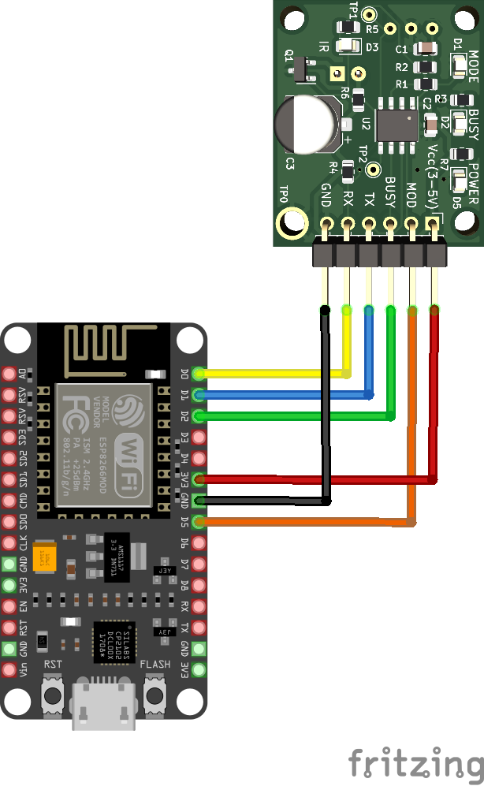

### ESP32:

- GPIO25 - BC7215A TX
- GPIO33 - BC7215A RX
- GPIO27 - BC7215A MOD
- GPIO26 - BC7215A BUSY
- 3.3V - BC7215A VCC

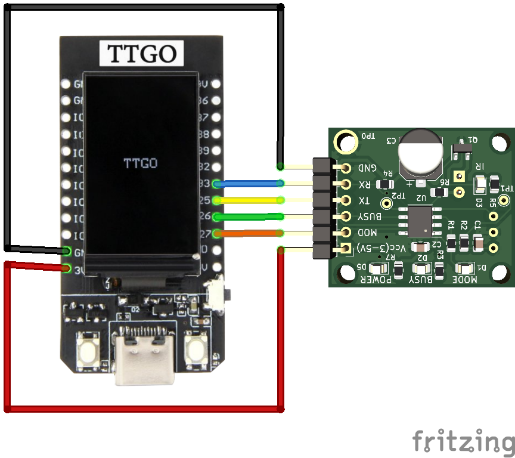

### Arduino NANO33 IoT:

- RX - BC7215A TX

- TX - BC7215A RX

- D3 - BC7215A MOD

- D2 - BC7215A BUSY

- 3.3V - BC7215A VCC
  
  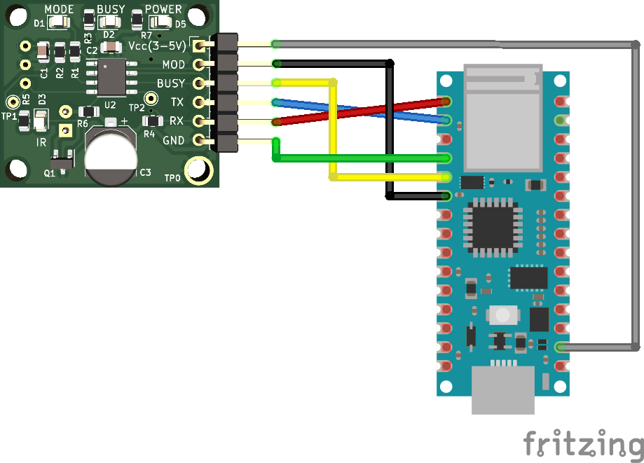

## 串口监视器版

通过 Arduino IDE 的串口监视器使用，串口波特率为 115200。提供了 3 个不同的版本：ESP8266， ESP32，及Nano33 版。

不同版本的菜单界面相同。

程序上传到 Arduino 板后，即可在串口监视器内看到主菜单。如果没有显示，是因为程序上传后串口监视器的启动迟于程序的启动，此时直接输入回车或者重启 Arduino 板，即可看到主菜单显示。

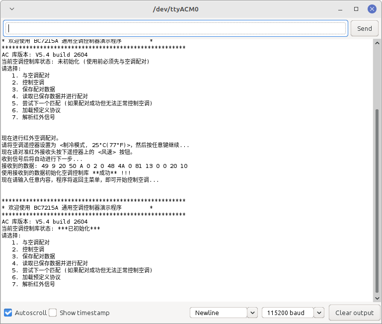

### 初次使用设置

初次使用时，应进行被控空调的遥控器的采样，并用采样数据进行遥控库的初始化。

初始化会分步进行，用户按照屏幕提示按步骤完成即可。通常将会初始化成功，如果多次尝试失败，且检查空调遥控器设置没有错误，则有可能所用的空调是极少数 BC7215A 无法直接解码的型号，这时可以逐个尝试使用"预定义协议"，测试是否可以控制。

### 空调控制

初始化成功后即可开始控制空调，控制空调有 2 级菜单：

- 第一级选择控制类型，是温度等参数，还是开关机
- 第二级为参数输入，可以输入温度、工作模式、风力大小、按键

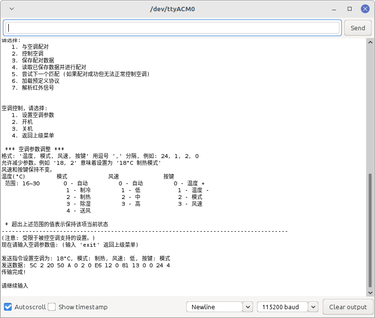

### 红外解析

主菜单选择7，进入红外解析模式，此时BC7215A进入接收状态，此后接收到红外信号时，则会将其中的温度、模式、风力、电源信息解析打印出来。

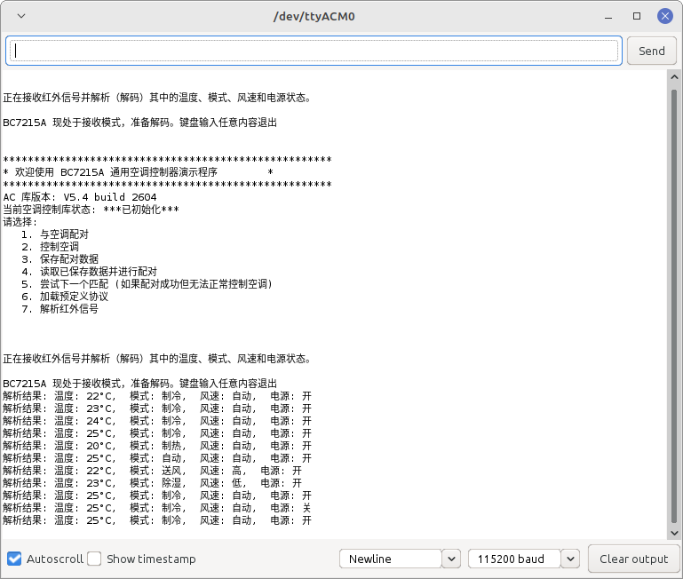

## ESP32 LCD 版

LCD 版使用 TTGO T-Display 的 Arduino 板，自带 135x240 的液晶屏，驱动器为 ST7789，例子使用了 Bodmer 的 TFT_eSPI 库，可在 Arduino IDE 的库管理器中安装。

### 配置要求

该库需要用户根据硬件修改一个 User_Setup.h 的文件，该文件位于安装好的 TFT_eSPI 库的根目录，适合本例程的设置文件在所安装 BC7215AC 库的 extras/config 目录中，请将该目录中的 User_Setup.h 文件拷贝到 TFT_eSPI 库的根目录并替换同名文件。

### 操作说明

程序初次使用时，程序运行后，会进入菜单，用板上左键 SEL 选择菜单项，右键 OK 确认。

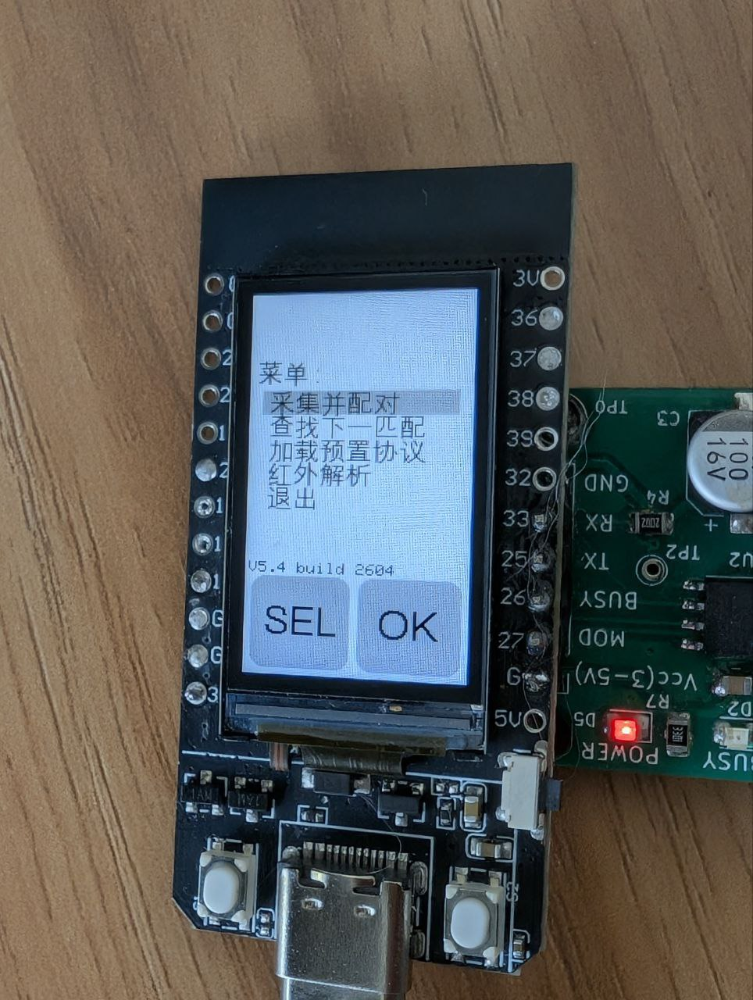

第一步请先进行初始化，按照屏幕提示完成遥控器信号的采集。

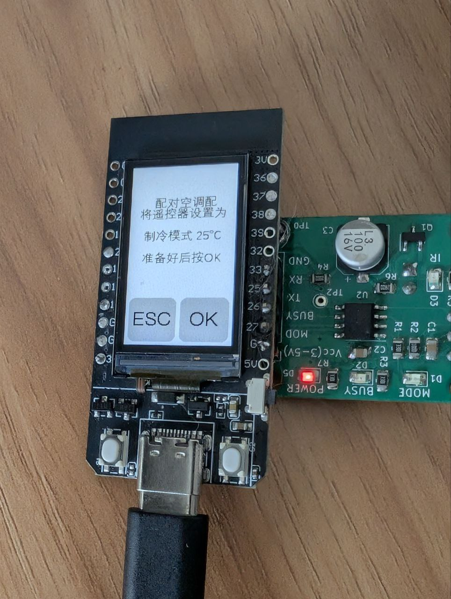

如果初始化成功，程序就会进入空调控制页面。

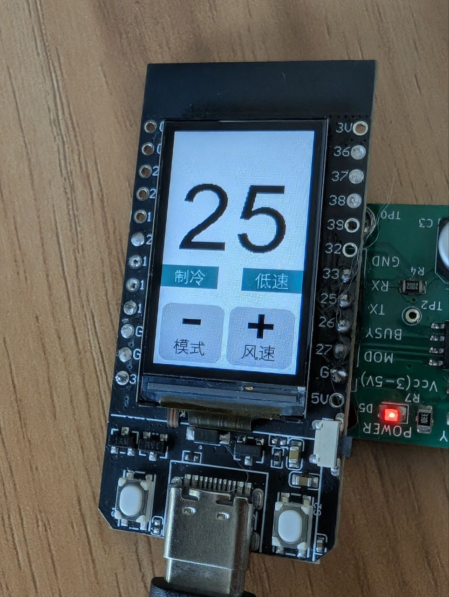

### 控制页面按键功能

- **左键短按** - 温度减
- **右键短按** - 温度加
- **左键长按** - 切换模式
- **右键长按** - 切换风速
- **双键短按** - 进入开关机页面，左右键变为开机/关机按键，分别发送开关机指令
- **双键长按** - 进入菜单

当所做操作会改变空调状态时，程序会驱动 BC7215A 芯片发射相应红外信号，同时屏幕右上角会有红外发射的指示标识。

## ESP32 MQTT 版

MQTT 版在 LCD 版的基础上增加了使用 MQTT 协议联网控制和空调状态上报的功能。MQTT 联网功能，使用的是 Nick O'Leary 的 PubSubClient 库，可从 Arduino IDE 的库管理器中安装。

MQTT 版的本机操作部分和 LCD 版完全相同，联网操作部分，请按照以下步骤进行：

### 1. 程序编译前准备

在程序编译之前，请先去掉源文件中以下几行的注释，并填入自己的内容，否则程序无法正常运行：

```cpp
// WiFi 和设备配置 - 请替换为您自己的值
// #define MY_WIFI_SSID "你的 WiFi 名称"     // 替换为您的 WiFi 名称
// #define MY_WIFI_PASSWORD "你的 WiFi 密码" // 替换为您的 WiFi 密码
// #define MY_UUID "你的 UUID"              // 使用 UUID 生成器创建唯一设备 ID
```

除了 WiFi 的名称和密码，请使用任何一种 UUID 生成器（网上有 UUID 生成器）生成你自己的 UUID，以确保唯一性，否则如果与他人使用相同的 UUID，当他人设备上线时，你的设备会被 MQTT 服务器踢下线。

一个 UUID 看起来如下面的格式：`b1225e25-81c8-43d7-8183-6f5793408242`

程序的 MQTT 代理(服务器)，默认使用 `broker.hivemq.com`，也可替换为任何支持不加密 1883 端口访问且不需要帐号/密码的公共 MQTT 代理服务器，如中国境内的 `broker.emqx.io`。

**注意：** 本示例仅为演示使用，使用的是不加密连接，生产环境中建议使用加密连接，以提高安全性。

### 2. 网络控制空调

程序开始运行后，即开始尝试 WiFi 连接，WiFi 连上后，就会开始尝试 MQTT 服务器的连接，当 MQTT 连接成功后，会在屏幕顶部看两个 WiFi 和 MQTT 的标志（假设空调遥控库已经初始化完成）。

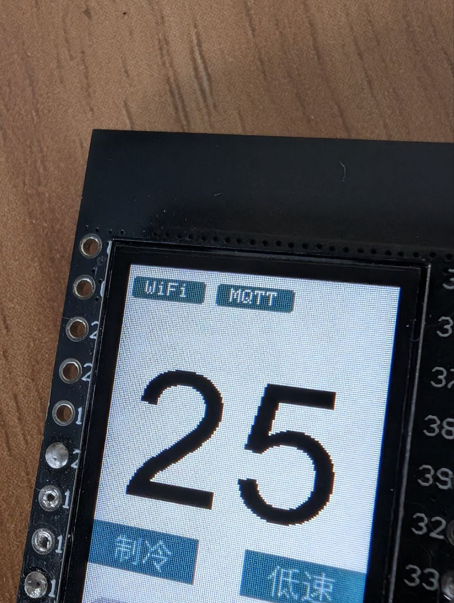

连接成功后，即可通过 MQTT 协议来控制空调。空调控制的话题(Topic)分别如下：

- **温度**：`BC7215A/（UUID）/var/temp`
- **模式**：`BC7215A/（UUID）/var/mode`
- **风力**：`BC7215A/（UUID）/var/fan`
- **电源**：`BC7215A/（UUID）/var/power`

其中 UUID 即为源程序中定义的 MY_UUID。实际的话题最终为类似下面的样子：
`BC7215A/b1225e25-81c8-43d7-8183-6f5793408242/var/temp`

发布控制消息时，内容为 ASCII 形式的数字，如温度为字符"16"至"30"，模式为"0"至"4"

#### 参数范围

**temp**: 范围 16-30 的整数

**mode**:

- 0 - 自动
- 1 - 制冷
- 2 - 制热
- 3 - 除湿
- 4 - 送风

**fan**:

- 0 - 自动
- 1 - 低
- 2 - 中
- 3 - 高

**power**:

- 0 - 关
- 1 - 开

### A/C Online Monitor

连接MQTT服务器后，任何空调的状态变化，都会被发布到MQTT服务器，包括执行的MQTT指令，以及本地操作，如果程序工作于解析模式，则会将解析的结果发布出去。因此你可以从网络监控空调的状态，哪怕用户是使用传统的红外遥控器来操作空调。

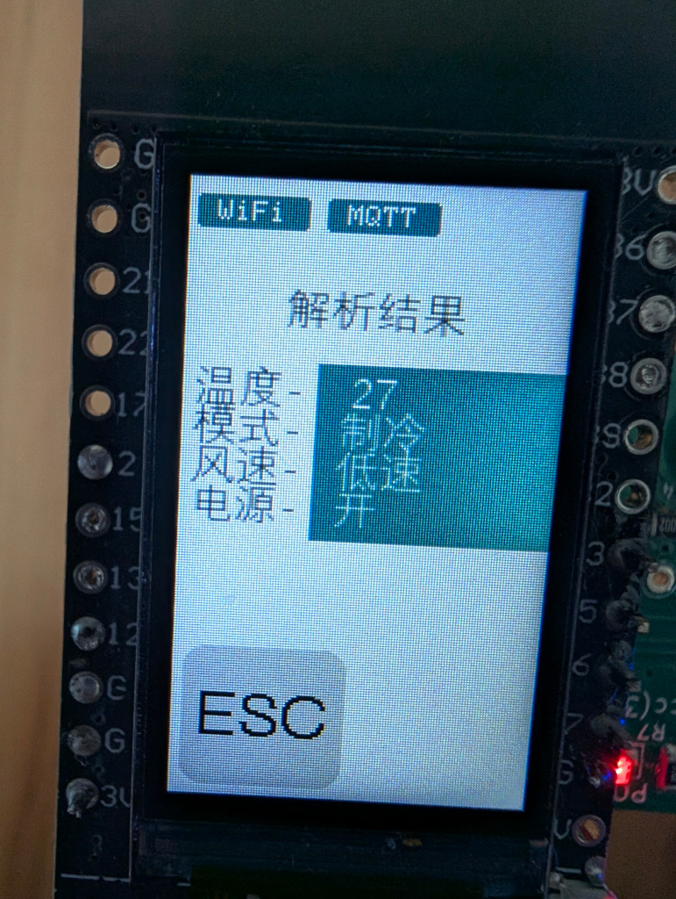

## MQTT 客户端

一般公共免费 MQTT 服务器都会同时提供免费的客户端供用户使用，当然亦可以使用任何用户所习惯使用的 MQTT 客户端发布控制消息。

演示程序使用非加密连接，但发布控制消息的 MQTT 客户端，可以采用任何连接方式和连接端口，仅需连接同一个服务器且话题(topic)相同即可。

**hivemq.com 的网页版 MQTT 客户端**：https://www.hivemq.com/demos/websocket-client/

使用方法如下：打开上面网址后，出现初始页面，作为免费测试，此时不用填写任何内容，直接点击“Connect"即可。

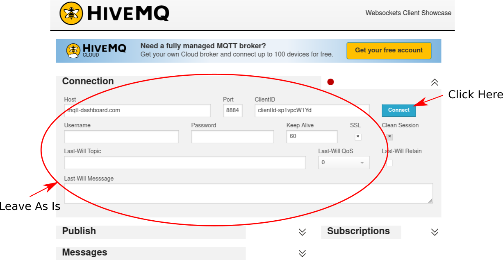

连接后，设置Topic，即可使用，使用的界面如下：

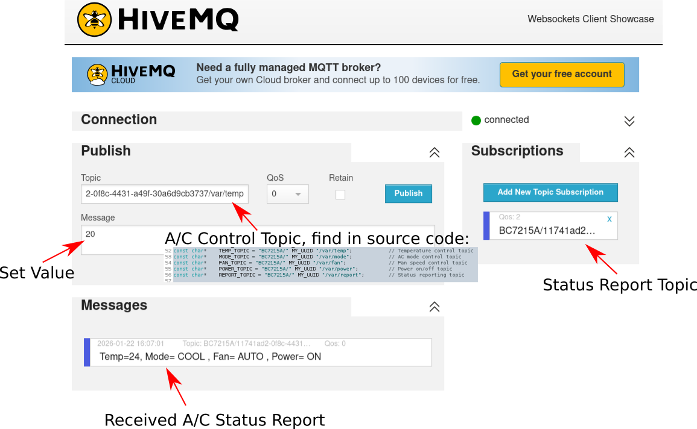

Public区域用于联网空调控制，Message部分填入设置值，如欲设置温度为20, 填写20即可。

Subscriptions为网络客户端所接收的Topic，即空调状态的上报Topic，而Messages部分则是收到的空调状态报告。

## 空调状态上报

每次发射红外指令改变空调状态，包括通过本机上按键操作，或者在红外解析状态收到了红外信号，都会同时状态态上报至 MQTT 服务器，如果客户端订阅了报告话题，就会在客户端看到更新后的空调状态。

演示程序的报告话题是：`BC7215A/（UUID）/var/report`

<title></title>

<style type="text/css">
 @page { size: 21cm 29.7cm; margin: 2cm }
 h1 { margin-bottom: 0.21cm; background: transparent; page-break-after: avoid }
 h1.western { font-family: "Liberation Sans", sans-serif; font-size: 18pt; font-weight: bold }
 h1.cjk { font-family: "Noto Sans CJK SC"; font-size: 18pt; font-weight: bold }
 h1.ctl { font-family: "Lohit Devanagari"; font-size: 18pt; font-weight: bold }
 p { line-height: 115%; margin-bottom: 0.25cm; background: transparent }
 a:link { color: #000080; text-decoration: underline }
 </style>

# ESP32 Home Assistant版

在ESP32
MQTT版的基础上，将MQTT的参数针对Home Assistant的要求进行了修改，在使用Home Assistant且为其安装了MQTT插件的情况下，能够自动接入MQTT且被其发现而无需任何设置，能够以即插即用的方式并入HA的系统，并用HA控制空调。

当上电且空调配对成功后，Home Assistant中，就会自动出现空调的控制器。

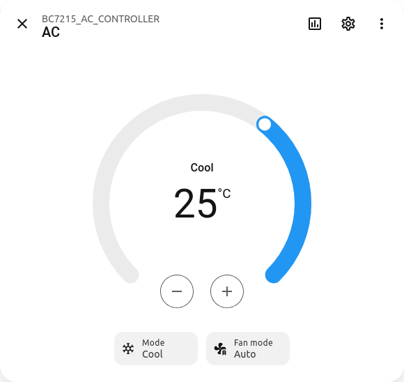

程序中配置为使用本地局域网的MQTT服务器，因为在使用Home Assistant的情况下，最佳的选择就是使用本地的MQTT服务器，这样因为无安全方面的担忧可以免去帐号密码以及加密连接等一系列繁琐的设置。

Home Assistant版保留了ESP32 MQTT版的所有操作，只是将MQTT服务器设置和MQTT主题等按照Home Assistant的需求进行了修改。

# ESP8266 Home Assistant版

在ESP32版的基础上，去掉了LCD显示和按键操作部分，仅使用板上的唯一按键作为重新配对的按钮，当长按2s后，程序会进入配对模式，此时用户直接对着红外接收头发射“25°C制冷模式”的信号即可。因为去掉了显示，仅以板载的一个LED作为工作状态指示：

- LED慢闪 —— 未连接BC7215A

- LED较快闪烁 —— 配对状态，等待接收红外信号

- LED每3s短暂闪烁一下 —— 已配对成功，指令解析状态，等待接收红外信号

因为缺少了用户交互，因此省略了很多操作，如选择“选择温度制式”，“下一匹配”和“使用预定义数据”，但也足以覆盖绝大多数的情况了。同时，因为没有在本机操作控制空调的功能，配对成功后，会直接进入解析模式，如果用户用红外遥控器操作空调，最新空调状态会同步到HA.